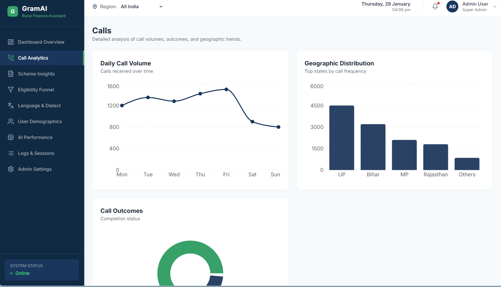
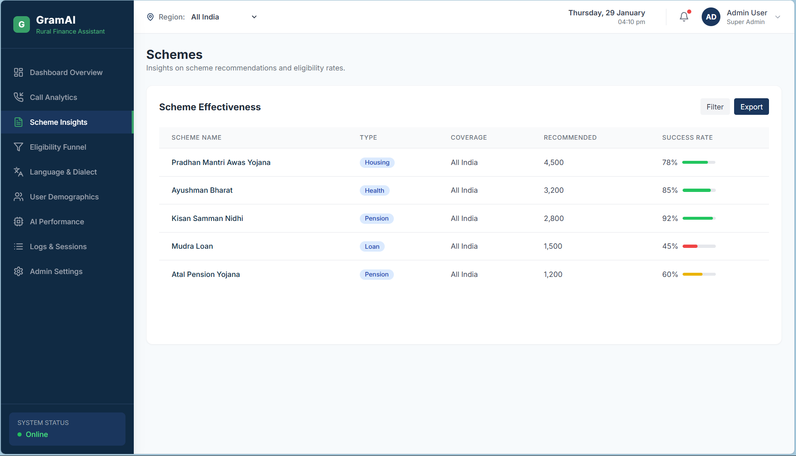
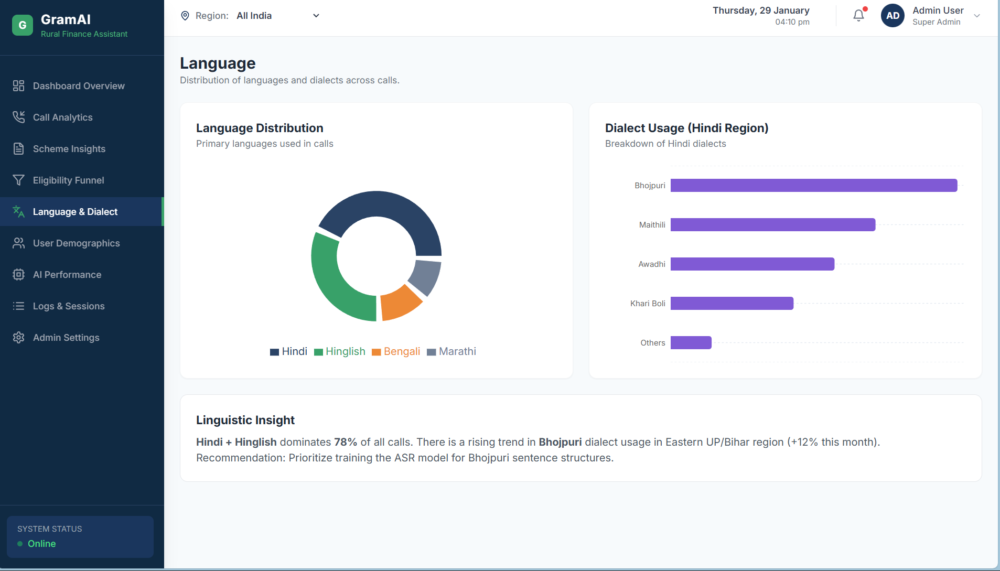

<!-- GramAI

GramAI is an AI-powered phone helpline that helps rural citizens understand and access government welfare and financial schemes through a simple phone call. It is designed for people who may not use smartphones, mobile apps, or the internet, and works entirely through spoken conversation in the caller’s local language. -->

<!-- Many government schemes exist for farmers, workers, women, and low-income households, but a large number of eligible citizens are either unaware of them or unsure about how to apply. Language barriers, complex eligibility rules, and dependence on intermediaries often prevent people from receiving benefits they qualify for. GramAI aims to reduce this gap by making scheme information easy to access, accurate, and personalized.

A user interacts with GramAI by calling a helpline number from any basic phone. The system listens to the caller, identifies the language being spoken, and guides the conversation naturally instead of using rigid IVR menus. GramAI asks a few simple questions, such as age range, occupation, or location, only to the extent required to understand eligibility.

Based on this information, GramAI evaluates which government schemes may apply to the caller. It then explains these schemes in clear, simple language, covering key benefits, required documents, and where the user can apply. The entire interaction is voice-based and does not require reading, typing, or navigating digital interfaces.

Alongside citizen interactions, GramAI also provides an administrative dashboard. This dashboard shows aggregated and anonymized insights from calls, such as which schemes are most frequently discussed, which regions show lower awareness, and how users are engaging with the system. These insights can help authorities improve outreach efforts and identify gaps in scheme awareness at the ground level.

GramAI is built as a modular system so that language processing, eligibility evaluation, and conversation flow can evolve independently. The project focuses on accessibility, inclusivity, and clarity, with the goal of making public welfare information reachable to everyone, regardless of language, literacy level, or access to technology. -->

📞GramAI
Voice-First AI Helpline for Government Schemes & Financial Inclusion

GramAI is a voice-first AI phone helpline designed to help rural and underserved citizens discover, understand, and access government welfare and financial schemes through a simple phone call — without requiring smartphones, apps, or internet literacy.

The system enables citizens to interact naturally in their local language, making public welfare information accessible to everyone, regardless of literacy level or access to technology.

🌍 Problem Statement

India has thousands of central and state government schemes for:

Farmers
Senior citizens
Women
Workers
Low-income households

Yet, a large number of eligible citizens never benefit because of:
Language barriers
Complex eligibility rules
Lack of awareness
Dependence on intermediaries
Limited access to digital platforms
As a result, welfare delivery remains fragmented and inaccessible for the very people it is meant to support.

💡 Solution: GramAI

GramAI bridges this gap using voice-based AI.
Instead of navigating websites, apps, or IVR menus, a user simply:
Calls a helpline number from any basic phone
Speaks naturally in their preferred language
Answers a few simple questions
Receives clear, personalized guidance on relevant schemes

No reading.
No typing.
No smartphone required.

🧠 How GramAI Works

1️⃣ Voice-First Interaction
Users interact entirely through spoken conversation
No rigid IVR menus
Natural, conversational flow

2️⃣ Language & Context Awareness
Automatically detects the caller’s language
Adapts responses to local linguistic preferences
Maintains conversation context across the call

3️⃣ Eligibility-Driven Guidance
Asks only the minimum required questions
Evaluates eligibility using structured rules
Avoids misinformation or guesswork

4️⃣ Clear & Actionable Responses
Explains:
Scheme benefits
Required documents
Where and how to apply
Uses simple, non-technical language

🏗️ System Architecture (High Level)

GramAI is designed as a modular system, allowing independent evolution of each layer:

Voice Layer

Call handling
Speech-to-Text
Text-to-Speech
AI Intelligence Layer

Intent detection

Entity extraction
Conversation planning
Rule-based eligibility evaluation

Data Layer

Government scheme database
State and category-specific rules

Analytics & Admin Layer
Aggregated call insights
Scheme awareness trends
Regional engagement patterns

📊 Admin & Analytics Dashboard

Alongside citizen interactions, GramAI provides a web-based administrative dashboard for government bodies and program administrators.

Dashboard Capabilities:
📈 Call volume trends
🧾 Most discussed schemes
🗺️ Region-wise awareness gaps
🧠 AI decision insights
⏱️ Conversation effectiveness metrics

All data is:
Aggregated
Anonymized
Privacy-preserving

This allows authorities to make data-driven policy and outreach decisions without compromising user privacy.

Snapshots of our admin dashboard 

